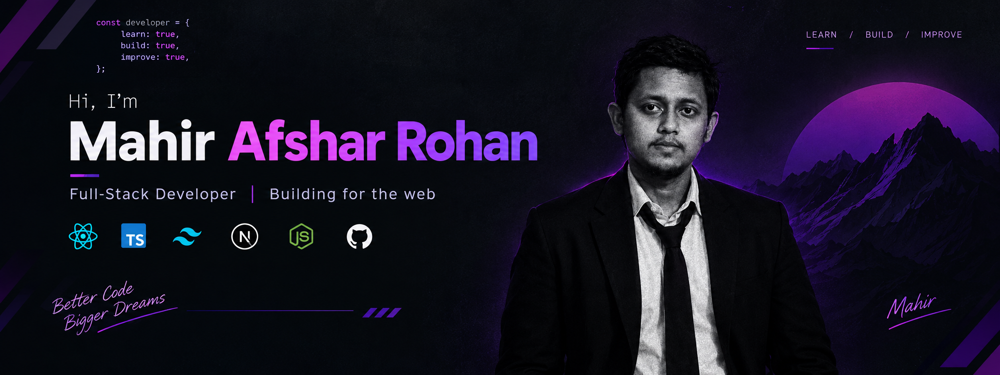

<!-- ===================== BANNER ===================== -->

<p align="center">
  
</p>

<!-- ===================== INTRO ===================== -->

<h1 align="center">Hi 👋, I'm Mahir Afshar Rohan</h1>

<h3 align="center">
  A passionate Full-Stack Developer from Bangladesh
</h3>

<p align="center">
  
</p>

---

<!-- ===================== ABOUT ME ===================== -->

## 👨‍💻 About Me

- 🌱 I’m currently learning **React, TypeScript, Tailwind CSS and Next.js**
- 💻 I enjoy building real-world web applications
- 🚀 Always learning new technologies and improving my development skills
- ⚡ Fun fact: **I enjoy turning ideas into real projects and continuously improving my development skills.**
- 📫 Reach me at **mahirafsher333@gmail.com**

---

<!-- ===================== CONNECT ===================== -->

## 🤝 Connect With Me

<p align="left">

<a href="https://linkedin.com/in/mahir-afshar-rohan">
  
</a>

<a href="https://fb.com/mahirhithere">
  
</a>

<a href="https://instagram.com/mahir_afshar">
  
</a>

<a href="mailto:mahirafsher333@gmail.com">
  
</a>

</p>

---

<!-- ===================== TECH STACK ===================== -->

## 🛠️ Languages & Tools

### Frontend

<p align="left">


</p>

### Backend & Database

<p align="left">


</p>

### Tools

<p align="left">


</p>

---

<!-- ===================== CURRENTLY LEARNING ===================== -->

## 🌱 Currently Learning

<p align="center">


</p>

<p align="center">
  <b>React • TypeScript • Tailwind CSS • Next.js</b>
</p>

---

<!-- ===================== GITHUB ===================== -->

## 📊 GitHub

<p align="center">

<a href="https://github.com/mahir-afshar">
  
</a>

<a href="https://github.com/mahir-afshar?tab=repositories">
  
</a>

<a href="https://github.com/mahir-afshar?tab=stars">
  
</a>

</p>

---

<!-- ===================== GITHUB ACTIVITY ===================== -->

## ⚡ GitHub Activity

<p align="center">

<a href="https://github.com/mahir-afshar">
  
</a>

</p>

---
<!-- ===================== GITHUB STREAK ===================== -->

## 🔥 GitHub Streak

<p align="center">
  
</p>


---
<!-- ===================== PROJECTS ===================== -->

## 🚀 Featured Projects

### 💻 Dev Stack Builder

A React + TypeScript application for building and managing your ideal development stack.

**Tech Stack:**

`React` `TypeScript` `Tailwind CSS` `Vite`

<a href="https://github.com/mahir-afshar/B14-A05">
  
</a>

---

### 🏋️ Fit Log

A Next.js fitness application focused on workouts, workout details and personal plans.

**Tech Stack:**

`Next.js` `TypeScript` `Tailwind CSS`

<a href="https://github.com/mahir-afshar">
  
</a>

---

<!-- ===================== GOALS ===================== -->

## 🎯 My Goal

> **Learn. Build. Improve. Repeat.**

I'm working toward becoming a professional **Full-Stack Web Developer** by continuously learning, building projects, solving problems, and improving my development skills.

---

<!-- ===================== CURRENT FOCUS ===================== -->

## 🔥 Current Focus

```text
HTML & CSS
     ↓
JavaScript / ES6
     ↓
TypeScript
     ↓
Tailwind CSS
     ↓
React
     ↓
Next.js
     ↓
Full-Stack Development 🚀
